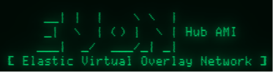

# Evon Hub

Evon Hub is the core component of the Evon system, acting as the central network hub for connected servers, users and policy. It provides a web application and an API along with OpenVPN services for overlay network connectivity.

Evin Hub must be deployed on an AWS EC2 instance running Amazon Linux 2.

## Deployment

### Arguments Reference

The below invocations make reference to these arguments:

* `<ENV>` is one of `dev`, `staging` or `prod`
* `<EC2_FQDN>` is the FQDN of the target EC2 instance to which you have SSH access to the `ec2-user` using public key authentication.
* `<PREFIX>` is the first label of the new Hub FQDN, which will become `<PREFIX>.env.evon.link` (where env is one of 'dev', 'staging', or empty for prod). The Web UI and API can be reached via HTTPS to the Hub FQDN.
* `<SK>` is the subnet key. It must be between 64 and 127 inclusive. The overlay subnet for the deployed Hub becomes `100.<SUBNET_KEY>.224.0/19`

### Publishing installer to EC2 only

To copy the Evon Hub installer script to a remote EC2 instance run the below command. Resultant package will be at path `/home/ec2-user/bin/evon-deploy` which is in the `ec2-user`'s `$PATH`. Once published, the script must subsequently be run on the Hub via SSH.
```
make ENV=<ENV> EC2_HOST=<EC2_FQDN> publish
```

### Publishing an updated version of Evon Hub for customers

| :warning: Do not publish updates containing breaking changes to the Hub API |
|---------------------------------------------------------------------------------|

Customer deployments are able to udpate/autoupdate their product. To publish an update, run
```
make ENV=<env> publish-update
```
This will put the package in S3, ready to be picked up by customer deployments during next auto/manual update.


### Building an EC2 instance ready for converting to an AMI

| :memo: The target EC2 must be freshly installed in the `us-east-1` region |
|---------------------------------------------------------------------------|

```
make ENV=<ENV> EC2_HOST=<EC2_FQDN> deploy-base
```
Once done, manually export the EC2's EBS device as an AMI.

For procedure, refer to [EVON AWS Marketplace Integration docs](https://linuxdojo.atlassian.net/wiki/spaces/EVON/pages/138379265/AWS+Marketplace+Integration)

### Deploy to Staging Environment

* subscribe and deploy Evon Hub from AWS Marketplace
* use `make ENV=staging EC2_HOST=<EC2_FQDN> publish` to upload latest deploy script
* ssh to ec2 and run `evon-deploy` as ec2-user

### Deploying to a test EC2 instance (any region)

For development purposes, to copy and also run the Evon Hub installer script on a remote EC2 instance in one command, run:
```
make ENV=<ENV> EC2_HOST=<EC2_FQDN> DOMAIN_PREFIX=<PREFIX> SUBNET_KEY=<SK> deploy-test
```

### Quick Deploy

This is a convenience target for developers to quickly sync local project elements to remote dev ec2 instance. It requires that root ssh with pub key auth has been setup.

### Example

Example publish and deploy:
```
make ENV=dev EC2_HOST=ec2-13-236-148-138.ap-southeast-2.compute.amazonaws.com RUN_INSTALLER=true DOMAIN_PREFIX=mycompany SUBNET_KEY=111 deploy-test
```

Deployment durations:
* A publish and deploy on a fresh t2.micro EC2 instance takes approximately 12 mins.
* Subsequent publish and deploy operations take approximately 2 mins on the same system.

## Usage

Once published and deployed, the Hub WebUI can be reached at `https://<PREFIX>.<env>.evon.link` (`<env>` is ommited if `prod`).

Default Web UI login credentials are:
|   |   |
|---|---|
|__Username__| admin |
|__Password__| `<EC2 Instance ID of Hub>` |
